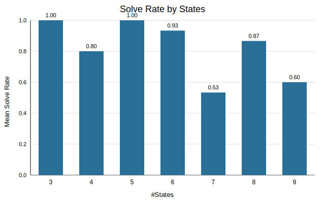
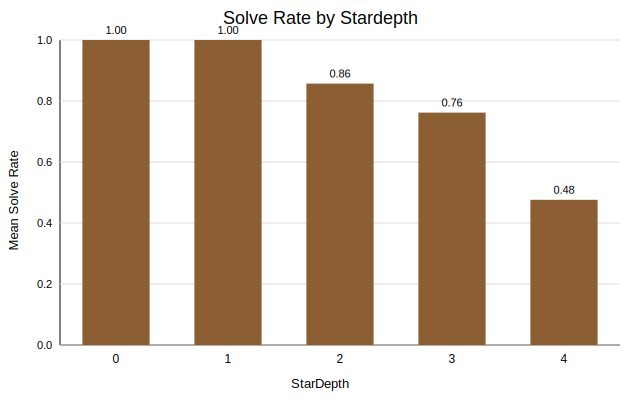
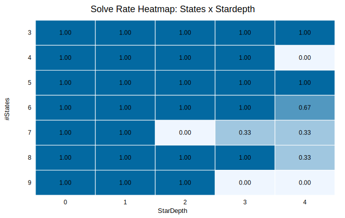
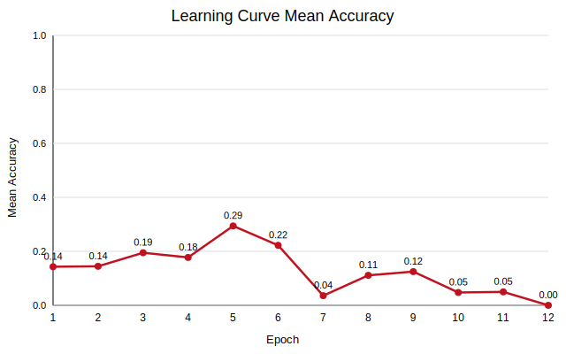

# Scaleup ICL-Gen Results (gpt5/std/reg)

## Headline
- Regexes: 35, runs total: 95, overall solve rate: 0.768
- Solved in all runs: 22, unsolved in all runs: 8
- Median first-solve sample size (across regex medians): 192.0

## Visualizations
- 
- 
- 
- 

## Per-Regex Table

| ID | #States | Stardepth | Solved Runs | Solve Rate | Median First Solve Samples | Final Acc (r0/r1/r2) | Regex |
|---|---:|---:|---:|---:|---:|---|---|
| R34 | 3 | 0 | 3/3 | 1.000 | 6 | 1/1/1 | `(a ((a+a)+a))` |
| R28 | 3 | 1 | 3/3 | 1.000 | 192 | 1/1/1 | `(((b)*+a)+c)` |
| R17 | 3 | 2 | 3/3 | 1.000 | 96 | 1/1/1 | `(((((c)* a) ((b)* (b)*))+((a)* ((a b) (a)*))))*` |
| R15 | 3 | 3 | 3/3 | 1.000 | 384 | 1/1/1 | `(((((b)*+c)+b) (((c ((a)* c)))*+(c+c))))*` |
| R03 | 3 | 4 | 3/3 | 1.000 | 384 | 1/1/1 | `(((((((a)* (b (c)*)))*+(a (c)*)))* ((a+a) (b)*)))*` |
| R33 | 4 | 0 | 3/3 | 1.000 | 3 | 1/1/1 | `((c (b+b)) c)` |
| R29 | 4 | 1 | 3/3 | 1.000 | 384 | 1/1/1 | `(((b)*+c) (((a)*+(b)*) (b)*))` |
| R14 | 4 | 2 | 3/3 | 1.000 | 96 | 1/1/1 | `(((((b a))*+a))*+(c)*)` |
| R31 | 4 | 3 | 0/1 | 0.000 |  | 0/-/- | `((c ((((a)* ((b (c)*))*)+((a+b)+(b)*)) (a)*)))*` |
| R04 | 4 | 4 | 0/2 | 0.000 |  | 0/0/- | `(((((((a)*+a))* (((((c)* (c)*)+(b b)))* (b c))))* a))*` |
| R30 | 5 | 0 | 3/3 | 1.000 | 12 | 1/1/1 | `(((c a) a) c)` |
| R21 | 5 | 1 | 3/3 | 1.000 | 768 | 1/1/1 | `((((b)* c)+(c (a+b)))+((a+c) ((c)*+c)))` |
| R06 | 5 | 2 | 3/3 | 1.000 | 192 | 1/1/1 | `(((((((c b) b))* ((c)*+a)))*+c)+(((b)*+a)+(c)*))` |
| R16 | 5 | 3 | 2/3 | 0.667 | 96 | 1/0/1 | `(((((c)* ((b)* (b c))))* b))*` |
| R35 | 5 | 4 | 3/3 | 1.000 | 96 | 1/1/1 | `(b (((c (((((b)*+b))* (c)*))*) (b b)))*)` |
| R32 | 6 | 0 | 3/3 | 1.000 | 3 | 1/1/1 | `((c (a (a b))) b)` |
| R18 | 6 | 1 | 3/3 | 1.000 | 48 | 1/1/1 | `((((a b))*+a)+(c b))` |
| R07 | 6 | 2 | 3/3 | 1.000 | 192 | 1/1/1 | `((((((a+a)+(c a)))* a))*+(c)*)` |
| R09 | 6 | 3 | 3/3 | 1.000 | 192 | 1/1/1 | `((((((c)*+c))* ((a)* a)) (a ((b b) c))))*` |
| R26 | 6 | 4 | 0/1 | 0.000 |  | 0/-/- | `(((a ((a)* c)) c) (((((((a)* c))* c))*+((c)* (b)*)))*)` |
| R27 | 7 | 0 | 3/3 | 1.000 | 3 | 1/1/1 | `(((a c)+(c b)) ((a a) a))` |
| R22 | 7 | 1 | 3/3 | 1.000 | 384 | 1/1/1 | `((((b)*+c) ((c)*+(c)*))+((b c))*)` |
| R05 | 7 | 2 | 0/1 | 0.000 |  | 0/-/- | `(((((((b+c)+a) (a ((b)*+b))) (b)*))*+c)+(b c))` |
| R23 | 7 | 3 | 1/3 | 0.333 | 384 | 1/0/0 | `((((c)* ((b)* c)) ((c (a (((b)* b))*)) (b)*)))*` |
| R25 | 7 | 4 | 0/1 | 0.000 |  | 0/-/- | `((((c)* b) (((a+c) (c ((a (a)*))*)))*))*` |
| R10 | 8 | 0 | 3/3 | 1.000 | 12 | 1/1/1 | `(((((a a)+a) c) (c (b+c))) ((c+c) a))` |
| R24 | 8 | 1 | 1/3 | 0.333 | 1280 | 0/1/0 | `((((c)* (a)*) ((c b)+c)) (((a)*+b)+(a)*))` |
| R12 | 8 | 2 | 1/3 | 0.333 | 768 | 1/0/0 | `(((((a)*+(b c)) (((c)* c) a))+(a c)))*` |
| R02 | 8 | 3 | 2/3 | 0.667 | 144 | 0/1/1 | `(((((((((c)*+b))* (b)*)+(b)*) a) b))*+((a+c) a))` |
| R08 | 8 | 4 | 0/3 | 0.000 |  | 0/0/0 | `((((((b)* (((c)* b))*))* (((b+b)+a) a)))*+(c)*)` |
| R11 | 9 | 0 | 3/3 | 1.000 | 96 | 1/1/1 | `(((((a b) ((a c)+a)) ((b+c)+c)) (a+b))+(c c))` |
| R13 | 9 | 1 | 3/3 | 1.000 | 1280 | 1/1/1 | `(((((a)*+(b c)) a)+((a)* ((c)* (a)*)))+((a b) b))` |
| R20 | 9 | 2 | 3/3 | 1.000 | 384 | 1/1/1 | `((((b)* c))*+(((b+b) ((c b) (c a)))+(a (a)*)))` |
| R19 | 9 | 3 | 0/2 | 0.000 |  | 0/0/- | `((((b)* a) (((((c+c) (a c)) (c (c)*)))*+((b)*+c))))*` |
| R01 | 9 | 4 | 0/3 | 0.000 |  | 0/0/0 | `((((((((((b)* a))*+b) c))*+(a+c)))*+(b)*) ((b (c)*)+b))` |

## Files
- `per_regex_summary.csv` (full table with full regex strings and source file paths)
- `group_summary.csv`
- `heatmap_states_stardepth.csv`
- `overall_summary.json`